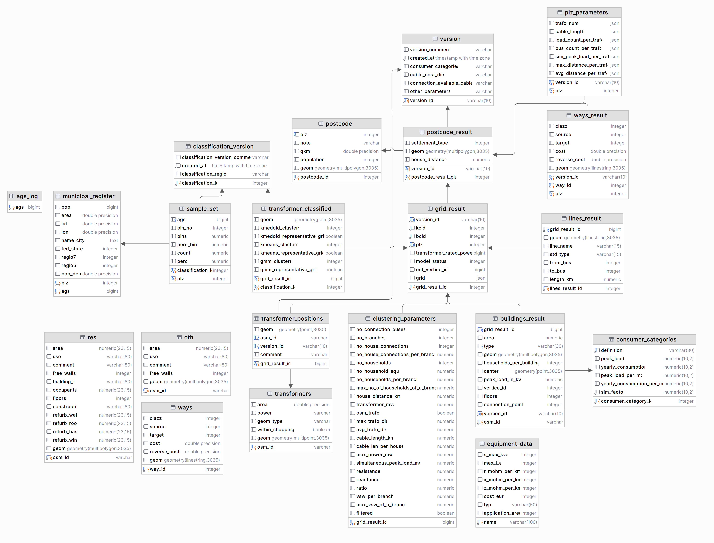

The Database Architecture of Pylovo
===================================

The database follows a hierarchical structure:

#. **Version Level** (``version``) - Tracks which version grids belongs to
#. **Postal Code Level** (``postcode_result``) - Top-level geographical organization
#. **Grid Cluster Level** (``grid_result``) - Individual grids within postal codes
#. **Building Level** (``buildings_result``) - Individual buildings and consumers
#. **Infrastructure Level** - Lines, transformers, and equipment

Foreign Key Constraints
-----------------------

Referential integrity is ensured thorugh relationships between tables (foreign keys).
When a row of a parent table is deleted, all related rows in child tables are also deleted.
This helps maintain data consistency and integrity across the database.

For example, deleting a ``version`` row will delete all related rows in ``postcode_result``,
which cascades to ``grid_result``, and other tables.

It is also guaranteed, for example, taht a ``transformer_position`` row cannot exist without a corresponding
``grid_result`` row, ensuring that all transformers are associated with a grid.

A diagram of the database structure with all of its tables and relationships is shown below:

Data Source Tables
==================

+---------------------+--------------------------------------------------------------------------------------+
| Table Name          | Description                                                                          |
+=====================+======================================================================================+
| postcode            | Contains postal code information. Used for determining a boundaries of a postal code.|
+---------------------+--------------------------------------------------------------------------------------+
| municipal_register  | Municipal administrative data linked to postcodes. Used to determine which postcode  |
|                     | belongs to which ags.                                                                |
+---------------------+--------------------------------------------------------------------------------------+
| res                 | Residential building data table used for importing residential buildings.            |
+---------------------+--------------------------------------------------------------------------------------+
| oth                 | Non-residential buildings with simplified structure used for importing               |
|                     | non-residential buildings.                                                           |
+---------------------+--------------------------------------------------------------------------------------+
| ways                | Street data is imported here.                                                        |
+---------------------+--------------------------------------------------------------------------------------+
| equipment_data      | Electrical equipment specifications and costs, derived from the YAML transformer and |
|                     | cable configuration blocks.                                                          |
+---------------------+--------------------------------------------------------------------------------------+
| transformers        | Transformer infrastructure from OpenStreetMap data.                                  |
+---------------------+--------------------------------------------------------------------------------------+
| consumer_categories | Defines different types of electrical consumers with their load characteristics,     |
|                     | also from a CSV-file.                                                                |
+---------------------+--------------------------------------------------------------------------------------+
| ags                 | Logs which ags region buildings have been imported into the database.                |
+---------------------+--------------------------------------------------------------------------------------+

Version Control
===============

+------------------------+-----------------------------------------------------------------------------------+
| Table Name             | Description                                                                       |
+========================+===================================================================================+
| version                | Tracks versions in the database so that the same grid can be generated across     |
|                        | different versions for example.                                                   |
+------------------------+-----------------------------------------------------------------------------------+
| classification_version | Tracks different classification versions.                                         |
+------------------------+-----------------------------------------------------------------------------------+

Result Tables
=============

+---------------------+--------------------------------------------------------------------------------------+
| Table Name          | Description                                                                          |
+=====================+======================================================================================+
| postcode_result     | Each grid generation generates multiple grids in a postcode.                         |
+---------------------+--------------------------------------------------------------------------------------+
| grid_result         | A grid result row uniquely identifies a generated grid.                              |
+---------------------+--------------------------------------------------------------------------------------+
| buildings_result    | Buildings relevant to a grid are stored here.                                        |
+---------------------+--------------------------------------------------------------------------------------+
| ways_result         | Ways that are part of a grid.                                                        |
+---------------------+--------------------------------------------------------------------------------------+
| lines_result        | Electrical lines of a grid.                                                          |
+---------------------+--------------------------------------------------------------------------------------+
| pandapower_bus      | Typed bus elements extracted from the pandapower net and linked by ``grid_result_id`` (includes ``geo`` as GeoJSON). |
+---------------------+--------------------------------------------------------------------------------------+
| pandapower_line     | Typed line elements extracted from the pandapower net and linked by ``grid_result_id`` (includes ``geo`` as GeoJSON). |
+---------------------+--------------------------------------------------------------------------------------+
| pandapower_trafo    | Typed transformer elements extracted from the pandapower net and linked by ``grid_result_id``. |
+---------------------+--------------------------------------------------------------------------------------+
| pandapower_load     | Typed load elements extracted from the pandapower net and linked by ``grid_result_id``. |
+---------------------+--------------------------------------------------------------------------------------+

Classification
==============

+--------------------------+----------------------------------------------------------------------------------+
| Table Name               | Description                                                                      |
+==========================+==================================================================================+
| sample_set               | Stores sampled data for classification algorithms.                               |
+--------------------------+----------------------------------------------------------------------------------+
| transformer_classified   | Results of transformer clustering analysis using multiple algorithms.            |
+--------------------------+----------------------------------------------------------------------------------+

Parameter Storage
=================

+------------------------+-----------------------------------------------------------------------------------+
| Table Name             | Description                                                                       |
+========================+===================================================================================+
| clustering_parameters  | Detailed clustering analysis parameters for each grid result.                     |
+------------------------+-----------------------------------------------------------------------------------+
| plz_parameters         | Parameters at postal code level stored as JSON.                                   |
+------------------------+-----------------------------------------------------------------------------------+

Views
-----

The schema includes several views that combine data across tables:

+------------------------------------------+--------------------------------------------------------------------------+
| View Name                                | Description                                                              |
+==========================================+==========================================================================+
| transformer_positions_with_grid          | Transformer positions with grid cluster context.                         |
+------------------------------------------+--------------------------------------------------------------------------+
| transformer_classified_with_grid         | Classification results with grid cluster context.                        |
+------------------------------------------+--------------------------------------------------------------------------+
| buildings_result_with_grid               | Building results with grid cluster context.                              |
+------------------------------------------+--------------------------------------------------------------------------+
| lines_result_with_grid                   | Line results with grid cluster context.                                  |
+------------------------------------------+--------------------------------------------------------------------------+

Spatial Data
------------

All geometric data uses EPSG:3035 coordinate reference system.

SQL-first Net Characteristic Queries
------------------------------------

For generated grids, you can query key characteristics directly from SQL without JSON deserialization.

Pylovo expects pandapower 3.x ``geo`` columns for bus and line geodata.
GeoJSON values are persisted directly in ``pylovo.pandapower_bus.geo`` and
``pylovo.pandapower_line.geo`` without fallback conversion paths.

Example: retrieve line and load aggregates per grid.

.. code-block:: sql

    SELECT
        gr.grid_result_id,
        gr.version_id,
        gr.plz,
        gr.kcid,
        gr.bcid,
        COUNT(pl.pp_index) AS line_count,
        COALESCE(SUM(pl.length_km), 0.0) AS total_line_length_km,
        COUNT(pld.pp_index) AS load_count,
        COALESCE(SUM(pld.p_mw), 0.0) AS total_active_load_mw
    FROM pylovo.grid_result gr
    LEFT JOIN pylovo.pandapower_line pl
        ON pl.grid_result_id = gr.grid_result_id
    LEFT JOIN pylovo.pandapower_load pld
        ON pld.grid_result_id = gr.grid_result_id
    GROUP BY gr.grid_result_id, gr.version_id, gr.plz, gr.kcid, gr.bcid
    ORDER BY gr.version_id, gr.plz, gr.kcid, gr.bcid;