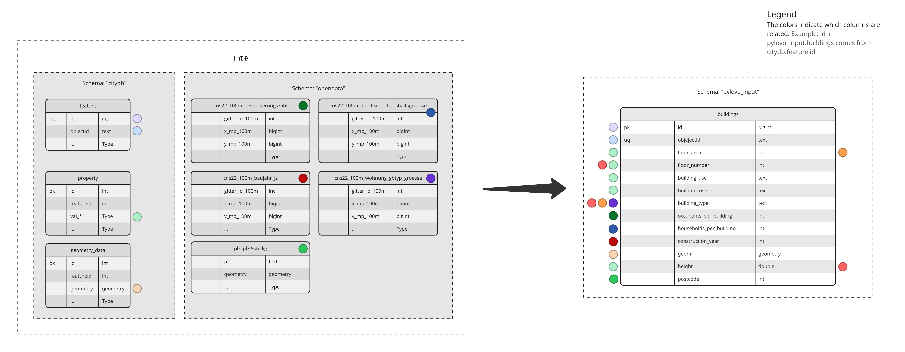
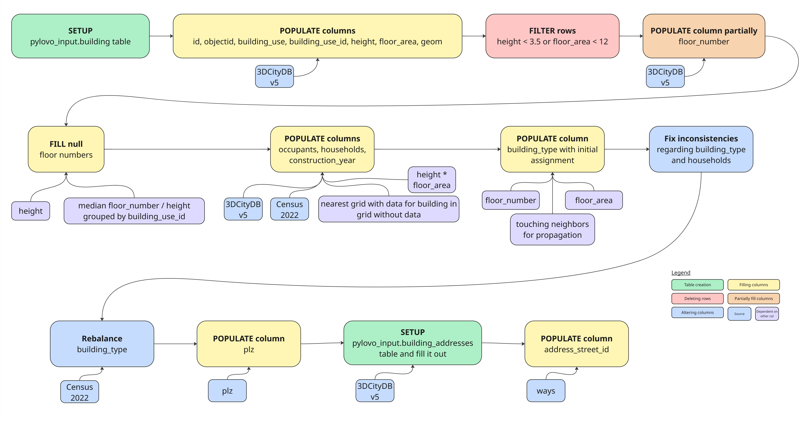

InfDB Buildings Processor
=========================

In order for Pylovo to use the buildings data from InfDB, the data needs to be put into a single table first:
``pylovo_input.buildings``.
That is the purpose of the processor in InfDB.

Data Sources
------------

The processor uses three types of InfDB data:

- **3DCityDBv5**: Building data
- **Census**: Statistical data in 100m x 100m grids
- **Basemap**: Mostly relevant for ways processing

3DCityDBv5 lies in the ``citydb`` schema. Census and Basemap are located in the ``opendata`` schema.

A visual overview of the column sources of ``pylovo_input.buildings`` can be seen in the following image:

- The ``id`` column in ``pylovo_input.buildings`` is derived from the ``id`` column in the ``citydb.feature`` table.
- The ``objectid`` column in ``pylovo_input.buildings`` comes from the ``objectid`` column in the ``citydb.feature`` table.
- The ``geom`` column in ``pylovo_input.buildings`` is sourced from the ``geometry`` column in the ``citydb.geometry_data`` table.
- The ``building_use_id``, ``building_use``, ``floor_area``, and ``height`` columns are from the corresponding ``val_*`` columns in the ``citydb.property`` table.
- The ``floor_number`` column is derived from corresponding ``val_*`` columns in the ``citydb.property`` table and the ``height`` column in the ``pylovo_input.buildings`` itself when data is missing.
- The ``construction_year`` column is taken from the ``opendata.cns22_100m_baujahr_jz`` table.
- The ``building_type`` column is mapped from the ``opendata.cns22_100m_wohnung_gbtyp_groesse`` table combined with ``height`` and ``floor_area``.
- The ``occupants_per_building`` column is taken from the ``opendata.cns22_100m_bevoelkerungszahl`` table.
- The ``households_per_building`` column is derived from the ``opendata.cns22_100m_durchschn_haushaltsgroesse`` table.
- The ``postcode`` column is sourced from the ``plz`` column in the ``opendata.plz_plz-5stellig`` table.

Column Roles
------------

- **id**: ID of a building
- **objectid**: Another unique ID of a building used in citydb
- **geom**: 2D geometry of a building in EPSG:3035
- **building_use_id**: ID of the role of the building
- **building_use**: Can be ``'Residential'``, ``'Industrial'``, ``'Commercial'`` or ``'Public'``
- **floor_area**: Area of the ground floor
- **height**: Height of the building
- **floor_number**: Number of floors the building has
- **construction_year**: Can be ``'-1919'``, ``'1919-1948'``, ``'1949-1978'``, ``'1979-1990'``, ``'1991-2000'``, ``'2001-2010'``, ``'2011-2019'`` or ``'2020-'``
- **building_type**: Can be ``'AB'`` (Apartment building), ``'MFH'`` (Multi-family house), ``'TH'`` (Terrace house), ``'SFH'`` (Single-family house)
- **occupants_per_building**: Number of occupants assigned to a building
- **households_per_building**: Number of households assigned to a building
- **postcode**: Postcode that the centroid of the building is in

How data is filled
------------------

An overview of the processing steps can be seen in the following visualization:

#. The ``buildings`` table is created.
#. The columns ``id``, ``objectid``, ``building_use``, ``building_use_id``, ``height``, ``floor_area``, and ``geom`` are populated using CityDB.
#. Buildings that are too small are deleted because they probably don't use electricity.
#. The ``floor_number`` column is populated and the missing values are filled using the median in relation to the height of the building.
#. The columns ``occupants``, ``households``, and ``construction_year`` are populated using CityDB, Census, ``height``, and ``floor_area`` data combined with the nearest grid with data when data is missing from the own grid.
#. The column ``building_type`` is filled based on ``floor_number`` and ``floor_area`` combined with touching neighbors for type propagation.
#. Inconsistencies are fixed, for example, a single-family house can only have one household.
#. The ``building_type`` column is rebalanced according to the census data.
#. Using PLZ geometry data, each building is assigned a postcode.
#. Some buildings get assigned an ID of a way based on the address of the building in ``address_street_id``.

Assumptions
-----------

Building Size
~~~~~~~~~~~~~

- Floor area threshold: Buildings smaller than 12 m² are excluded (assumed not to need power/heating)
- Height threshold: Buildings under 3.5m height are excluded (assumed to be non-habitable structures)

Spatial Relationships
~~~~~~~~~~~~~~~~~~~~~

- Touching neighbor distance: Buildings within 0.01 meters are considered “neighbors” or rather touching and used for ``building_type`` propagation
- Grid assignment: Building centroids are used to assign buildings to census grid cells

Occupancy & Household Distribution
~~~~~~~~~~~~~~~~~~~~~~~~~~~~~~~~~~

- Population allocation: Residents are distributed proportionally based on building volume (floor_area * height) and census data
- Household size: Average household size from census data is used to estimate number of households based on volume of building (floor_area * height)
- Minimum households and occupants: At least 1 household and 1 occupant per residential building
- Building type household thresholds: SFH has 1 household, MFH has between 2 and 4, AB has more than 1 household

Construction Year Assignment
~~~~~~~~~~~~~~~~~~~~~~~~~~~~

- Probabilistic assignment: Construction years are assigned using weighted random distribution based on census data

Initial Building Type Classification Logic
~~~~~~~~~~~~~~~~~~~~~~~~~~~~~~~~~~~~~~~~~~

- Apartment Buildings (AB): 4+ floors OR (3+ floors + 3+ neighbors) OR floor area > 1500 m²
- Single-Family Houses (SFH): Floor area < 350 m² + ≤3 floors + no neighbors OR floor area < 200 m² + ≤2 floors + <2 neighbors
- Terraced Houses (TH): 80-150 m² floor area + 2-3 floors + 1-2 neighbors + similar size to neighbors (±20%)
- Multi-Family Houses (MFH): 2-3 floors OR (floor area > 150 m² + 1-3 neighbors)

Processing Steps
----------------

Initial Data Import and Filtering
~~~~~~~~~~~~~~~~~~~~~~~~~~~~~~~~~

- Building extraction: Imports buildings from feature table with function codes starting with '31001_', meaning buildings only
- Exclusions: Removes garages ('31001_2463') and water containers ('31001_2513')
- Use classification: Converts building function IDs to building use

Height Processing
~~~~~~~~~~~~~~~~~

- Height extraction: Retrieves building heights from nested property structure
- Height filtering: Removes buildings below 3.5m height threshold

Geometry and Floor Area Processing
~~~~~~~~~~~~~~~~~~~~~~~~~~~~~~~~~~

- Ground surface matching: Links buildings to their ground surfaces using objectid patterns
- Coordinate transformation: Converts geometries to EPSG:3035
- Area filtering: Removes buildings below 12 m² floor area

Floor Number Calculation
~~~~~~~~~~~~~~~~~~~~~~~~

- Direct extraction: Gets floor numbers from 'storeysAboveGround' property where available
- Estimation: For missing values, calculates floors using median height-per-floor ratios by building type

Touching Neighbors Analysis
~~~~~~~~~~~~~~~~~~~~~~~~~~~

- Neighbor identification: Creates materialized view of buildings within proximity threshold
- Neighbor counting: Counts neighbors for each building (including zero counts)

Occupancy Estimation
~~~~~~~~~~~~~~~~~~~~

- Population distribution: Distributes census population data proportionally based on building volume
- Household calculation: Estimates households using average household size from census data
- Residential focus: Only applies to buildings classified as residential
- Missing values: Are estimated using the nearest grid that does have values

Construction Year Assignment
~~~~~~~~~~~~~~~~~~~~~~~~~~~~

- Census data integration: Uses building age distribution from census
- Weighted random assignment: Assigns years within ranges based on statistical distribution
- Year ranges: -1919, 1919-1948, 1949-1978, 1979-1990, 1991-2000, 2001-2010, 2011-2019, 2020-
- Missing values: Are estimated using the nearest grid that does have values

Building Type Classification
~~~~~~~~~~~~~~~~~~~~~~~~~~~~

- Initial classification according to rules in the assumptions above
- Iterative updating: Buildings adjacent to classified buildings may inherit types based on similarity
- Fallback classification: Remaining unclassified residential buildings default to Apartment Buildings
- Household-based corrections: Adjusts types based on estimated household counts
- Single-household buildings: Buildings with 1 household become SFH (no neighbors) or TH (with neighbors)
- Multi-household adjustments: Buildings with 2-4 households become MFH, 5+ become AB
- Census rebalancing: Final step to align building type distribution with census reference data
- Reference mapping: Maps building types to census categories
- Grid-level targets: Calculates target counts per census grid cell
- Proportional scaling: Scales targets to match actual building counts per grid
- Conversion rules:
  - AB increases: Convert largest MFH and TH
  - MFH increases: Convert largest TH and smallest AB
  - TH increases: Convert smaller MFH
  - SFH increases: Convert smaller TH and MFH
- Household consistency: Maintains logical household count relationships

Last Augmentations
~~~~~~~~~~~~~~~~~~

- PLZ: Assign a postcode to each building
- Street ID: Assign a street ID to each building based on address of building and address of ways (possible null values)
