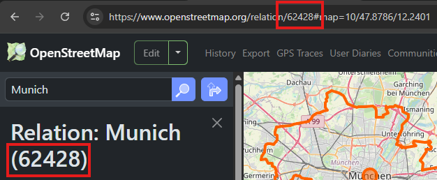

Installation
************

Setup Repository and Environment
============================
| Start by cloning the repository from GitHub into a directory of your choice.
| We recommend setting up a virtual environment to avoid conflicts with other packages.

A. Installation with `uv <https://docs.astral.sh/uv/>`_ project management (recommended)
----------------------------------------
| We recommend to use uv to install and manage your Python environment. If you don't have uv installed, you can install it with the following command:

::

    # For Linux and macOS
    curl -LsSf https://astral.sh/uv/install.sh | sh

    # For Windows (PowerShell)
    powershell -ExecutionPolicy ByPass -c "irm https://astral.sh/uv/install.ps1 | iex"

| Next, get the environment from the ``pyproject.toml`` file in the root directory of the repository:

::

    uv sync

That's it. If you use uv you can run all files with the ``uv run`` command as shown in later examples without additional need
to care about the virtual environments.

B. Installation with python virtual environments
----------------------------------------
Alternatively, you can also use virtual environments in python. If you have installed the required Python version
(Python3.12) on your system. You can create it with the following command:

::

    python3.12 -m venv venv

If you don't have the correct python version, you can also use `pyenv <https://github.com/pyenv/pyenv>`_ or
`virtualenv <https://virtualenv.pypa.io/en/latest/index.html#>`_ to use Python 3.12.

Next, you can activate the environment with:

::

    Linux: source venv/bin/activate
    Windows: venv/Scripts/activate

After activating the virtual environment, install the required packages:

::

    pip install -r requirements.txt

Database Configuration
=========================================
Create your database
----------------------------------------
- Install `PostgreSQL <https://www.postgresql.org/download/>`_ on your machine and make sure to keep "Stack Builder"
  checked if you are using an installer.
- Install `PostGIS <https://postgis.net/documentation/getting_started/>`_. If you installed Stack Builder use it to install PostGIS.
- `GDAL <https://gdal.org/en/stable/index.html>`_ is required for some geo-transformations. Ensure it is installed on your system. (e.g. for Ubuntu 24.04: ``sudo apt install gdal-bin``).
- Create your database with the appropriate configuration (dbname, user, password, host, port).
- Create a ``.env`` file in the root directory of the repository with these configurations.
- Your configurations might look like this:

::

    # PYLOVO Database
    DBNAME = "pylovo_db"
    USER = "postgres"
    HOST = "localhost"
    PORT = "5432"
    PASSWORD = "yourpassword"
    TARGET_SCHEMA = "pylovo" # optional, default is "public"

Input data
------------------
A. Using file-based raw data
~~~~~~~~~~~~~~~~~~~~~~~~~~~~~~~~~~~~~~~
The minimum data requirements for the ``raw_data`` directory are described below.
Some larger data files, which you can request from the maintainers at ENS, are not included in the repository due to their size (an online source will be available soon):

- Building shapefiles (``res_<ags> and oth_<ags>``) in the ``buildings`` directory
- Street SQL data (``ways_public_2po_4pgr.sql``) in the ``ways`` directory
- The postcode data (``postcode.csv``) for Germany including the geometries in the ``raw_data`` directory

Other required data files that are already included in the raw_data directory of the repository:

- ``transformer_data/substations_bayern.geojson``
- ``consumer_categories.csv``
- ``equipment_data.csv``

B. Using InfDB data for buildings and ways (Recommended)
~~~~~~~~~~~~~~~~~~~~~~~~~~~~~~~~~~~~~~~
| As loading the shapefiles and SQL files is quite inefficient, we recommend using the InfDB database developed at our chair to get the buildings, ways and postcode data.
To do so, setup the fully dockerized InfDB from the corresponding `GitHub repository <https://github.com/tum-ens/InfDB>`_
Make sure to also run the processor in your InfDB instance. For more information check out ``src/services/processor/Readme.md`` in the InfDB repository.

| Then, before running the ``main_constructor.py`` script to initialize the pylovo database set the ``USE_INFDB: True`` in the
``config/config_database.yaml`` file.
| Next, the connection configurations set in the InfDB have to be added in the pylovo repository as
well: add the InfDB configuration to your ``.env`` file below the pylovo configurations:

::

    # PYLOVO Database
    DBNAME = "pylovo_db"
    USER = "postgres"
    HOST = "localhost"
    PORT = "5432"
    PASSWORD = "yourpassword"
    TARGET_SCHEMA = "pylovo" # optional, default is "public"

    # InfDB Database (Input Data)
    INFDB_DBNAME="infdb"               # replace
    INFDB_USER="infdb_user"            # replace
    INFDB_HOST="00.000.00.000"          # replace
    INFDB_PORT=5432                     # replace
    INFDB_PASSWORD="infdb"    # replace
    INFDB_SOURCE_SCHEMA="basedata"  # InfDB processor puts relevant tables into "pylovo_input" schema

.. note::
    If you want to keept it simple, you can also add the pylovo database as schema to the InfDB database by setting the same connection parameters and a
    ``TARGET_SCHEMA`` such as ``pylovo`` in the ``.env`` file.

Load raw data to the database
~~~~~~~~~~~~~~~~~~~~~~~~~~~~~~
The ``main_constructor.py`` script initializes and populates the **pylovo** database. Run:

::

    uv run python -m runme.main_constructor

.. warning::

   This script should only be used when a new database is required, as it will overwrite existing tables in your database. Use caution when running this script in production environments.

Below is a detailed outline of its functionality:

1. **Database Initialization**
   A new database is created and initialized using the class ``SyngridDatabaseConstructor``. This includes the addition of required PostGIS and pgRouting extensions to your database.

2. **Importing Raw Data**

   - CSV files containing raw data (specified by a predefined file list, ``CSV_FILE_LIST``) are imported into the database.
   - The ways data is processed and imported into the database.
   - The imported ways data is converted into a format suitable for further analysis (e.g., transforming OSM road network data into custom "ways" tables).

3. **Enhancing the Database with SQL Functions**

   - Essential SQL functions for querying and processing the data are added to the database.
   - This includes utility functions for geospatial data transformations and advanced query support.

4. **Municipal Data Creation**
   The ``create_municipal_register`` function creates a table containing all German municipalities and cities, serving as the foundation for multiple processes:

   - **Grid Generation**: The PLZ code (Postleitzahl) defines areas for grid creation.
   - **Building Dataset Import**: The AGS (Amtlicher Gemeindeschlüssel) is required for linking municipal data with building datasets (see :doc:`../../grid_generation/index`).
   - **Area Classification**: The Regiostar class is necessary for categorizing municipalities, enabling accurate analyses (see :doc:`../../classification/index`).

Additional hints
==============================
.. hint::
    - If you are working on Windows, we recommend using the Windows Subsystem for Linux (WSL) for the setup and to run the scripts.
    - To avoid path conflicts run all scripts from the directory root or setup your IDE running configuration accordingly.
    - As it appears within the repository make sure to exclude your virtual environment directory from version control and from your IDE project.
    - Our default spatial reference system for geographic data is EPSG:3035 (meters - LAEA Europe). OSM-Input data are often given in EPSG:3857 (meters - web maps). The pandapower networks are per default generated in EPSG:4326 (lon/lat - world). Be mindful of these different reference systems.

Explore more materials
==============================

For deeper understanding of the tool and the results you can...

- ...follow the documentation to generateo your first synthetic grid with pylovo :doc:`../../grid_generation/usage/usage`)
- ...go through the jupyter notebook tutorials.
- ...after generating grids open the QGIS file to directly visualize the data from your database with the predefined layouts (see :doc:`../visualisation/qgis/qgis`).
- ...read our publication (see :doc:`../../further_reading`) to understand the methodology in more detail

Optional steps
==============
If you want more control over your input data follow instructions below:

(Optional) Preprocess transformers from OSM data
------------------------------------------------
By default the database is populated with preloaded data of transformers in Bavaria, which are directly available
in the repository: ``raw_data/transformer_data/fetched_trafos/2145268_*.geojson``.

If you want to fetch up-to-date data from OSM upon setting up the database with ``runme/main_constructor.py``, delete
the ``raw_data/transformer_data/processed_trafos/*_trafos_processed.geojson`` file before running the script.
Pylovo will then know to fetch new data before importing it.

It is not necessary to delete ``raw_data/transformer_data/fetched_trafos/2145268_*.geojson``.
Pylovo will fetch new data from OSM even if they are there, since the processing part afterwards takes much longer.

If you want to fetch up-to-date data upon running ``runme/main_constructor.py`` from a different area
then change the ``RELATION_ID`` in ``src/data_import/import_transformers.py`` to the relation ID
of the desired area.

.. note::
    Processing transformer data can take around **50 minutes** for entire German states.

How to find desired relation ID
~~~~~~~~~~~~~~~~~~~~~~~~~~~~~~~
1. Go to `OpenStreetMap <https://www.openstreetmap.org/>`_.

2. Search for the desired location (area). For example: "*Munich*".

3. Select the area from the list of results.

4. Copy the relation ID from the URL (after *relation/*) or copy it from the left sidebar (usually between brackets).

   **URL example:** https\://www.openstreetmap.org/relation/**62428**

   **Sidebar example:** Relation: Munich (**62428**)

How to add more transformer data after database has already been constructed
~~~~~~~~~~~~~~~~~~~~~~~~~~~~~~~~~~~~~~~~~~~~~~~~~~~~~~~~~~~~~~~~~~~~~~~~~~~~
To add more transformers from different areas after ``runme/main_constructor.py`` has been run, i.e. the database
has been constructed, simply run the ``runme/import/import_transformers_via_relation_id.py``
script as shown in the example below:

::

    $ python -m runme.import.import_transformers_via_relation_id --relation-id 62611
    Selected relation ID: 62611
    Corresponding area: Baden-Württemberg
    Do you want to continue? [Y/n]

How to configure transformer processing
~~~~~~~~~~~~~~~~~~~~~~~~~~~~~~~~~~~~~~~
Open the ``src/data_import/import_transformers.py`` file. At the top, there are constants you can change: ``AREA_THRESHOLD``, ``MIN_DISTANCE_BETWEEN_TRAFOS``, ``VOLTAGE_THRESHOLD``, and ``EPSG``.

  - The script ``runme/import/import_transformers_via_relation_id.py`` is for running from the terminal directly and fetches GeoJSON files form the Overpass API. (saved in ``raw_data/transformer_data/fetched_trafos``)

  - Then it imports the files, transforming the geodata according to the EPSG projection to calculate distances and areas. Transformers can be points or polygons.

  - First, any transformers that overlap are deleted. This often occurs in "Umspannwerke" (HV transformers) where multiple tags exist for the same location.

  - Second, all transformers larger than the ``AREA_THRESHOLD`` are deleted. LV transformers are either points or have smaller dimensions.

  - Finally, the processed data gets saved (into ``raw_data/transformer_data/processed_trafos``) and inserted into the database.

What do the queries do that fetch transformer data?
~~~~~~~~~~~~~~~~~~~~~~~~~~~~~~~~~~~~~~~~~~~~~~~~~~~~~
They can be found in ``raw_data/transformer_data``.

Assuming *Bayern* is selected:

 - ``substations_query.txt``: The query searches for the keywords "transformer" and "substation" in the area "Bayern." Substations from "Deutsche Bahn" as well as "historic" and "abandoned" substations are excluded. This query yields around 22,000 results. More information about transformer locations can be found on `OpenInfrastructureMap <https://openinframap.org/#12.73/48.18894/11.58542/>`_.

 - ``shopping_mall_query.txt``: The query searches for all places tagged with keywords indicating that nearby transformers do not belong to the LV grid (for example, "shopping malls" are likely directly connected to the MV grid). Other filters include land use related to the oil industry (e.g., refineries), power plants (e.g., solar fields), military training areas, landuse "rail," landuse "education," and large surface parking.

Make any changes to the Overpass queries that you see fit.

(Optional) Preprocess ways from OSM data
---------------------------------------
Use the following steps if you want to add more ways in addition to the default Bavarian ways provided with the ``public_2po_4pgr.sql`` file and set from ``main_constructor.py``:

1. Connect to the database via localhost.
2. Download the OSM street networks you require from `http://download.geofabrik.de/ <http://download.geofabrik.de/>`_.
3. Download Osm2po-5.3.6 from `https://osm2po.de/releases/ <https://osm2po.de/releases/>`_.

   .. note::
      It **must** be version 5.3.6. This guide does not work with later versions.

4. Extract the downloaded zip file.
5. Open the ``osm2po.config`` file in the extracted folder and ensure the following lines are set correctly (lines starting with ``#`` are commented out):
   - Line 59: ``tilesize=x``
   - Line 190: comment out ``.default.wtr.finalMask = car``
   - Lines 222-231: ensure only ``ferry`` is commented out
   - Line 341: must **not** be commented out, or the SQL file will not be generated.

6. Open a terminal and navigate to the ``Osm2po-5.3.6`` folder. Execute the following command:

::

    java -Xmx1g -jar osm2po-core-5.3.6-signed.jar prefix=public "C:/Users/path/to/osm/file/osm_file_name.pbf"

   - Replace ``C:/Users/path/to/osm/file/`` with the path to the Geofabrik file you downloaded earlier.
   - Replace ``osm_file_name.pbf`` with the name of the Geofabrik file.

7. Execute pylovo's ``main_constructor.py``.
   - Ensure the ``ways_to_db`` method is uncommented in ``main_constructor.py``.
   - The ways in the ``2po_4pgr`` table will be inserted into the ``ways`` table and can now be used by pylovo.

(Optional) Adjust SQL functions
-------------------------------
Prewritten SQL functions are created by the ``main_constructor`` script, so you can skip this step if you are using that script. The constructor uses the ``postgres_dump_functions.sql`` file in the ``pylovo`` folder. If you encounter issues or want to add SQL functions, edit and run the following file:

::

    psql -d pylovo_db -a -f "pylovo/postgres_dump_functions.sql"
